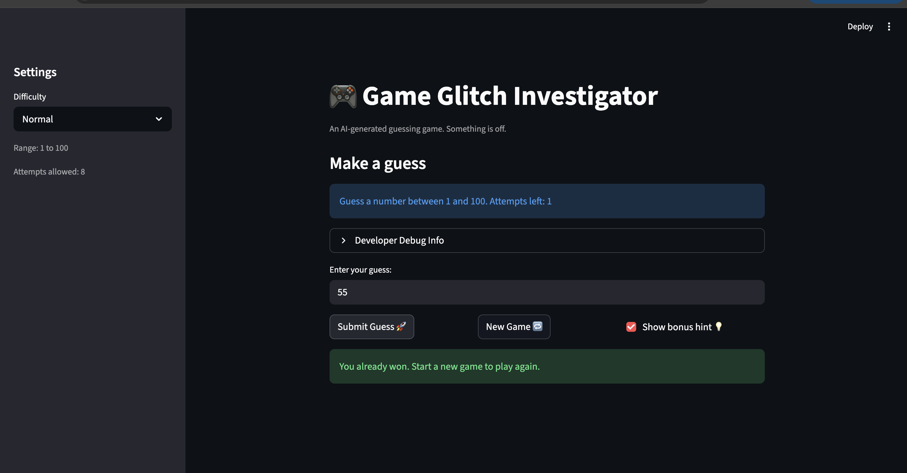

# 🎮 Game Glitch Investigator: The Impossible Guesser

## 🚨 The Situation

You asked an AI to build a simple "Number Guessing Game" using Streamlit.
It wrote the code, ran away, and now the game is unplayable. 

- You can't win.
- The hints lie to you.
- The secret number seems to have commitment issues.

## 🛠️ Setup

1. Install dependencies: `pip install -r requirements.txt`
2. Run the broken app: `python -m streamlit run app.py`

## 🕵️‍♂️ Your Mission

1. **Play the game.** Open the "Developer Debug Info" tab in the app to see the secret number. Try to win.
2. **Find the State Bug.** Why does the secret number change every time you click "Submit"? Ask ChatGPT: *"How do I keep a variable from resetting in Streamlit when I click a button?"*
3. **Fix the Logic.** The hints ("Higher/Lower") are wrong. Fix them.
4. **Refactor & Test.** - Move the logic into `logic_utils.py`.
   - Run `pytest` in your terminal.
   - Keep fixing until all tests pass!

## 📝 Document Your Experience

- [ ] Describe the game's purpose.
- [ ] Detail which bugs you found.
- [ ] Explain what fixes you applied.

The goal of this game is to prompt user to pick the correct number. Every time the user pick the number , system will check if the values is higer or lower than the actial value . Given the answer , system will refien by giving a range whihc will hint user where is the correct asnwer lies within the particualr range

One of the bugs i relaized was the hint feature is incorrect . So i add on a feature where it will tell user the corrct range and hint either is a sprime number or not . The second glitch I noticed is the reset game button does not resets the games . The third problem i identified is the delayed update in the Guess History , where it updates the number based on the previous value that user entered , not the current ones . 

I applied the following changes with claude by:
1. fixing the reset game taht restore the entire game to the initial state
2. Update the guess history that display the current value that user entered 
3. Change the hint that follows the logic flow 

## 📸 Demo

- [ ] [Insert a screenshot of your fixed, winning game here]

## 🚀 Stretch Features

- [ ] [If you choose to complete Challenge 4, insert a screenshot of your Enhanced Game UI here]
